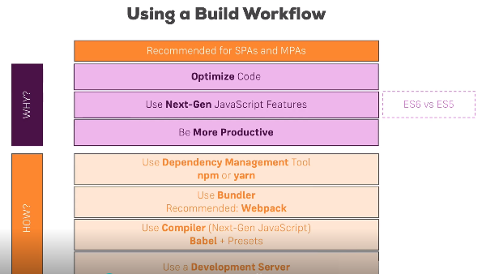

# Table of Contents

- [JavaScript Basics](#javascript-basics)
	- [Spread and Rest](#spread-and-rest)
	- [Destructuring](#destructuring)
	- [Copy of array](#copy-of-array)
	- [Array function](#array-function)
- [Start with react](#start-with-react)
	- [Basics of react](#basics-of-react)
	- [Installation](#installation)
- [React](#react)
	- [Component](#component)
	- [functions](#functions)
	- [Props](#props)
	- [State](#state)		
- [Component Life Cycle](#component-life-cycle)
	- [StateFull and Stateless](#statefull-and-stateless)
	- [constructor](#constructor)
	- [componentWillMount](#componentWillMount)
	- [render](#render)
	- [componentWillReciveProps](#componentWillReciveProps)
	- [shouldComponnentUpdate](#shouldComponnentUpdate)
	- [Life Cycle Video](https://www.youtube.com/watch?v=_1wGycclTnE&list=PLpdiIovPfYaS4iUQOtm-sBoNz0TEe6GXh&index=32)
- [EventHandling and Binding](#eventhandling-and-binding)
	- [EventBinding](#event-binding)
	- [Supply Other Parameters](#supply-other-parameters)


## JavaScript Basics
### Spread and Rest
are the three ... function in front of object/const.

Spread: to merge the one array with other data or object properties.

Ex:
```js
const numbers = [1, 2, 3, 4];
const newNumbers = [...numbers, 5, 6];
console.log(newNumbers);

O/P: [1, 2, 3, 4, 5, 6]
```
Rest: to convert the multiple args into an array.

Ex:
```js
const filter = (...args)=>{
  return args.filter(arg=> arg===1);
}
console.log(filter(1, 2, 3, 4));

O/P= [1]
```

### Destructuring
to store array elements/objects properties into variables.

Ex:
```js
const numbers = [1,2];
[num1, num2] = numbers;
console.log(num1, num2);

const person = {name:'suhail', age:32};
[name] = person;
console.log(name);
```
### Copy of array

Ex: If assigning one array to new one. it will copy the reference. so any modification in new array will change the orignal aray value.
```js
const arr = {name:'sam', age:32};
const newArr = arr;
newArr.name = 'newSam';
console.log(arr.name);

O/P: newSam
```

Solution: use spread operator.
```js
const arr = {name:'sam', age:32};
const newArr = {...arr};
newArr.name = 'newSam';
console.log(arr.name);

O/P: sam
```

### Array function 
functions to process each element of the array and return the new array.

Ex:
```js
const numbers=[1, 2, 3];
const multipleArr = numbers.map((num)=>{
  return num*2;
});
console.log(numbers);
console.log(multipleArr);

O/P: 
[1, 2, 3]
[2, 4, 6]

```
## Start with react
### Basics of react
- npm:      Node Package MAnager, a js depenedency resolver.
- webpack:  js project packing
- babel:    ES6/ES5 to normal js transpiler.



### Installation
- download node.js [click here, Ctrl+Click](https://nodejs.org/en/), and install.
- open command prompt and type below cmd to install global react package.
```npm
npm install -g create-react-app
```
- select the directorry using cd command and execcute the below command to create the react project.
```npm
npm create-react-app <project name>
```
- go to cd <project name> directory
```npm
npm start
 ```

## React
A component based javascript framework which uses a concept of virtual dom to render the component changes, if it find the changes in state of component.

### Component
A javascript based indipedent userdefined module(class).

Ex:

```js
import React from 'react'

class Href extends React.Component {
    render() {
        console.log(this.props);
        return (
            React.createElement('a',this.props, this.props.title)
        )
    };
}

export default Href; 
```

### Functions
An indipendent module to export the specific functionality.

Ex:
```js
import React from 'react'

const DigiClock = (props) => {
    return (
        <div>Current Time:{props.currentTime}</div>
    );
}

export default DigiClock;
```

### Props
To transfer the information between components.

Ex:
```js
//DigiClock.js
import React from 'react'

const DigiClock = (props) => {
    return (
        <div>Current Time:{props.currentTime}</div>
    );
}

export default DigiClock;

//Clock.js
import React from 'react'
import DigiClock from './DigiClock'

class Clock extends React.Component {

    currentTimeLocal = () => {
        return new Date().toLocaleString();
    }

    constructor(props) {
        super(props);
        this.state = {
            curentTime: this.currentTimeLocal(),
            counter: 0
        }
    }

    render() {
        console.log(this.state.curentTime);
    	return (
		<div>
	    		<DigiClock currentTime={this.state.curentTime}/>
		</div>
    	)
    }
};

export default Clock;

```

### State
To mantain the information with in component, and based on changes in state the render method will be invoked by React engine.

Ex:
```js

```

## Component Life Cycle
### constructor
In any component lifecycle it is the first method that will be invoked. It is must to call the super with props as fist method to supply the props data to extended component class.

Ex: 
```js
import React from 'react'

class Clock extends React.Component {

    currentTimeLocal = () => {
        return new Date().toLocaleString();
    }

    constructor(props) {
        super(props);
        this.state = {
            curentTime: this.currentTimeLocal(),
            counter: 0
        }
    }
    
    render() {
        console.log(this.state.curentTime);
        return (
		<div>
		    {this.state.curentTime}
		</div>
	    )
    }
};

```

### componentWillMount
Method will be invoked after constructor and before rendor of component.


### componentWillReciveProps
Invoke post rendor and before next rendor to validate if any changes are in props.
```js
componentWillReceiveProps(nextProps){
}
```

### shouldComponentUpdate
Invoke post componentWillReciveProps with nextProps and nextState data. Based on information we can take the decision if want to allow to update the component or not.

Return value is must true/false.
```js
shouldComponentUpdate(nextProps, nextState ){
	return true;
}
```

## EventHandling and Binding
### EventBinding
There are 2 ways of binding the event with components. 
a. Inside Constructor
b. From Event itself

```js
import React from 'react'

class EventHandling extends React.Component{

    constructor(props){
        super(props);
        this.state={
            counter:0
        };
//This is how to bind from constructor 
        this.counterHandler=this.counterHandler.bind(this);

    }

    counterHandler=()=>{
        this.setState({
            counter: this.state.counter+1
        })
    }

    render(){
        return (
            <div>
//Bind from Event it self.
                //<button onClick={this.counterHandler.bind(this)}>-</button>
		<button onClick={this.counterHandler}>-</button>
                <span>Counter:{this.state.counter} </span>
                <button onClick={this.counterHandler}>+</button>
            </div>
        )
    }
}

export default EventHandling
```

### Supply Other Parameters
If there is need to supply addiitional data from event.

```js
import React from 'react'

class EventHandling extends React.Component {

    constructor(props) {
        super(props);
        this.state = {
            counter: 0
        };
    }

    counterHandler = (param) => {
        this.setState({
            counter: (param === 'add') ? this.state.counter + 1 : this.state.counter - 1
        })
    }

    render() {
        return (
            <div>
                <button onClick={this.counterHandler.bind(this, 'minus')}>-</button>
                <span>Counter:{this.state.counter} </span>
                <button onClick={this.counterHandler.bind(this, 'add')}>+</button>
            </div>
        )
    }
}

export default EventHandling
```
